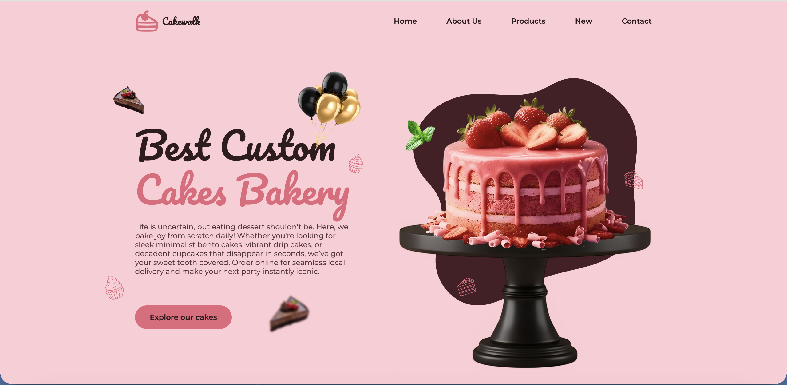

# Cakewalk

A modern, fully responsive e-commerce landing page for a premium cake shop and artisanal bakery. **Cakewalk** features a sleek UI with a custom pastel pink and rich chocolate color palette, smooth multi-device carousels, and optimized interactive components.

## Live Demo
✨ **[Click here to view the live website](https://varuntg156.github.io/cake-website/)** *(Note: Hold Ctrl or Cmd when clicking to open in a new tab, or use the live link in the repository sidebar on the right!)*

---

## Screenshots

### Desktop View


### Product Showcase


---

## Features
* **Elegant UI/UX:** A beautifully themed layout utilizing fluid typography, rich chocolate waves, and modern pastel tones.
* **Dynamic Product Catalog:** Interactive category tabs (Strawberry, Vanilla, Chocolate, etc.) to browse treats seamlessly.
* **Fully Responsive:** Mobile-first architecture optimized perfectly for smartphones, tablets, and desktops.
* **Contact & Location:** Structured layout displaying business hours, custom ordering forms, and location map integration.

---

## Tech Stack
* **Markup & Structure:** HTML5 (Semantic tags for optimal SEO and accessibility structure)
* **Styling & Layout:** CSS3 (Custom Properties/Variables, Flexbox, CSS Grid, and custom wave graphics)
* **Interactivity:** Vanilla JavaScript (ES6+ for clean DOM manipulation and behavior handles)
* **Libraries:** Swiper.js (Touch-enabled, responsive carousels), ScrollReveal (Smooth scroll-in animations)
* **Icons:** Remix Icons

---

## Getting Started

To run this project locally on your machine:

1. **Clone the repository:**
   ```bash
   git clone https://github.com/varuntg156/cake-website.git

2. **Navigate into the project directory:**
   ```bash
   cd cake-website

3. **Open the project:**
   * Double-click `index.html` to open it directly in your browser, or
   * Use the **Live Server** extension in VS Code for live-reloading during development.

---

## What I Learned & Solved
* **Asynchronous Integration & UI Sync:** Mastered initializing external slider libraries like Swiper.js alongside deep CSS layouts without triggering cumulative layout shifts (CLS).
* **Responsive Breakpoints:** Fine-tuned fluid sizing scales using CSS media queries to ensure floating graphic assets stay perfectly aligned across distinct hardware viewports.
* **Git Conflict Resolution:** Experienced managing upstream repository forks and synchronizing divergent local development histories smoothly back to GitHub.

---

## Acknowledgments & Credits
* **UI Design & Base Code:** Original assets, starter files, and structural layout design by [Bedimcode](https://github.com/bedimcode).
* **Tutorial Framework:** Developed by following along with Bedimcode's web development framework on [YouTube](https://www.youtube.com/watch?v=G6q7AkaljE4).
